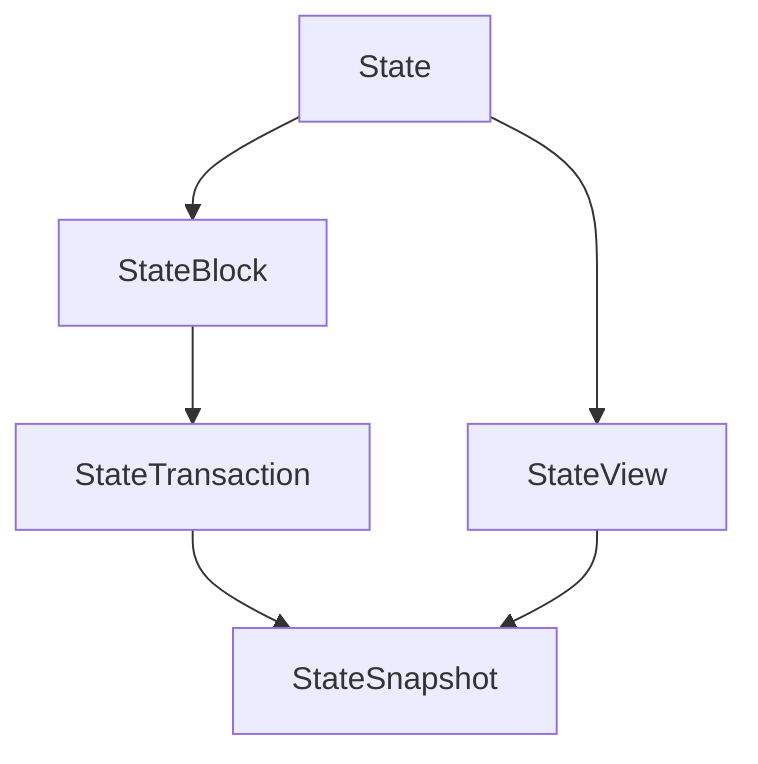

# iroha <span class="fs-3 right-align">[GitHub](https://github.com/hyperledger/iroha){: .btn .mr-4 }</span>


<div>
    <table>
        <tr>
            <td>
                PR <a href="https://github.com/hyperledger/iroha/pull/4066" class=".btn">#4066</a>
            </td>
            <td>
                <b>
                    [fix] #0000: fix stable client config
                </b>
            </td>
        </tr>
        <tr>
            <td>
                <span class="chip">iroha2</span>
            </td>
            <td>
                ## Description

<!-- Just describe what you did. -->

<!-- Skip if the title of the PR is self-explanatory -->

### Linked issue

<!-- Duplicate the main issue and add additional issues closed by this PR. -->

Closes #{issue_number} <!-- Replace with an actual number,  -->

<!-- Link if e.g. JIRA issue or  from another repository -->

### Benefits

<!-- EXAMPLE: users can't revoke their own right to revoke rights -->

### Checklist

- [ ] I've read `CONTRIBUTING.md`
- [ ] I've used the standard signed-off commit format (or will squash just before merging)
- [ ] All applicable CI checks pass (or I promised to make them pass later)
- [ ] (optional) I've written unit tests for the code changes
- [ ] I replied to all comments after code review, marking all implemented changes with thumbs up

<!-- HINT:  Add more points to checklist for large draft PRs-->

<!-- USEFUL LINKS 
 - https://www.secondstate.io/articles/dco
 - https://discord.gg/hyperledger (please ask us any questions)
 - https://t.me/hyperledgeriroha (if you prefer telegram)
-->

            </td>
        </tr>
    </table>
    <div class="right-align">
        Created At 2023-11-21 09:10:26 +0000 UTC
    </div>
</div>

<div>
    <table>
        <tr>
            <td>
                PR <a href="https://github.com/hyperledger/iroha/pull/4062" class=".btn">#4062</a>
            </td>
            <td>
                <b>
                    [feature] #4060: add support for boxed slices in FFI
                </b>
            </td>
        </tr>
        <tr>
            <td>
                <span class="chip">iroha2</span>
            </td>
            <td>
                ## Description

<!-- Just describe what you did. -->

<!-- Skip if the title of the PR is self-explanatory -->

### Linked issue

<!-- Duplicate the main issue and add additional issues closed by this PR. -->

Closes #4060

<!-- Link if e.g. JIRA issue or  from another repository -->

### Benefits

<!-- EXAMPLE: users can't revoke their own right to revoke rights -->

### Checklist

- [ ] I've read `CONTRIBUTING.md`
- [ ] I've used the standard signed-off commit format (or will squash just before merging)
- [ ] All applicable CI checks pass (or I promised to make them pass later)
- [ ] (optional) I've written unit tests for the code changes
- [ ] I replied to all comments after code review, marking all implemented changes with thumbs up

<!-- HINT:  Add more points to checklist for large draft PRs-->

<!-- USEFUL LINKS 
 - https://www.secondstate.io/articles/dco
 - https://discord.gg/hyperledger (please ask us any questions)
 - https://t.me/hyperledgeriroha (if you prefer telegram)
-->

            </td>
        </tr>
    </table>
    <div class="right-align">
        Created At 2023-11-20 15:29:17 +0000 UTC
    </div>
</div>

<div>
    <table>
        <tr>
            <td>
                PR <a href="https://github.com/hyperledger/iroha/pull/4061" class=".btn">#4061</a>
            </td>
            <td>
                <b>
                    [refactor] #2664: Introduce new wsv
                </b>
            </td>
        </tr>
        <tr>
            <td>
                <span class="chip">iroha2</span><span class="chip">Refactor</span><span class="chip">Optimization</span>
            </td>
            <td>
                ## Description

Introduce new in memory storage for iroha. 

New approach provide single reader, multiple readers where readers don't block writers and writer doesn't block readers. 

Single writer seems reasonable restriction since only single block is processed at the same time. 

Instead of single `WorldStateView` multiple transactions are now used.

Work is based on [`concread`](https://github.com/kanidm/concread) crate.



- `State` in-memory iroha storage
- `StateView` read-only snapshot of state at some point in time
- `StateBlock` aggregate state changes during block execution (need commit to take effect)
- `StateTransaction` aggregate state changes during transaction execution (need commit to take effect)
- `StateSnapshot` used to convert view and transaction to the same read-only type. 


<!-- Just describe what you did. -->

<!-- Skip if the title of the PR is self-explanatory -->

### Linked issue

<!-- Duplicate the main issue and add additional issues closed by this PR. -->

Closes #2664 <!-- Replace with an actual number,  -->

<!-- Link if e.g. JIRA issue or  from another repository -->

### Benefits

- Faster on large larger state
- Readers and writer are independent

<!-- EXAMPLE: users can't revoke their own right to revoke rights -->

### Benchmark results

Iroha tps benchmark was used. In this bechmark only small fraction of state is changed with single transaction (imo it's reasonable to expect that single transaction won't change whole state).

Genesis was generated with the following command: 

```bash
cargo run --bin kagami genesis --domains 250 --accounts-per-domain 100 --assets-per-domain 100 > configs/peer/genesis.json 
```
This command creates genesis about 400 Mb in size.


Set the following config for `clients/bench/config.json`

```json
{
    "peers": 1, // 4 -> 1 To speed up things
    "interval_us_per_tx": 0,
    "max_txs_per_block": 1024,
    "blocks": 15,
    "sample_size": 10,
    "genesis_max_retries": 1200 // Wait for large genesis to be committed
}
```

Than bench two times before and after changes in wsv.

```
export WSV_WASM_RUNTIME_CONFIG='{ "FUEL_LIMIT": 18446744073709551615, "MAX_MEMORY": 4294967295 }'
cd client
cargo run --release --example tps-oneshot
```

tps-oneshot results: 

Before update: tps=3.3077273188803833
After update: tps=2339.2057925660447

To measure memory consumption heaptrack was used. 

Allocation sizes and amounts:

Before:


After:


All relevant files: [link](https://drive.google.com/drive/folders/1AeagOk7KeO5VE2nTAPDNUSw4XZAT8APw).

### TODO

- [ ]: Create relevant issues
- [ ]: Rename no longer relevant variable names, update docs, ...

<!-- HINT:  Add more points to checklist for large draft PRs-->

<!-- USEFUL LINKS 
 - https://www.secondstate.io/articles/dco
 - https://discord.gg/hyperledger (please ask us any questions)
 - https://t.me/hyperledgeriroha (if you prefer telegram)
-->

            </td>
        </tr>
    </table>
    <div class="right-align">
        Created At 2023-11-20 14:40:27 +0000 UTC
    </div>
</div>

<div>
    <table>
        <tr>
            <td>
                PR <a href="https://github.com/hyperledger/iroha/pull/4058" class=".btn">#4058</a>
            </td>
            <td>
                <b>
                    [fix] #4057: Fix query store message ordering issue
                </b>
            </td>
        </tr>
        <tr>
            <td>
                <span class="chip">Bug</span><span class="chip">iroha2</span>
            </td>
            <td>
                ## Description

Previously 2 separate queues were used to send `insert`/ `remove` request to live query service which lead to issues when `insert`, `remove` were one right after another so that ordering of message processing was screwed.

Now single queue is used for messsages which guarantee that messages are processed sequentially eliminating possibility of this bug.  

<!-- Just describe what you did. -->

<!-- Skip if the title of the PR is self-explanatory -->

### Linked issue

<!-- Duplicate the main issue and add additional issues closed by this PR. -->

Closes #4057 <!-- Replace with an actual number,  -->

<!-- Link if e.g. JIRA issue or  from another repository -->

### Benefits

Bug is solved.

<!-- EXAMPLE: users can't revoke their own right to revoke rights -->

### Checklist

- [x] I've read `CONTRIBUTING.md`
- [x] I've used the standard signed-off commit format (or will squash just before merging)
- [x] All applicable CI checks pass (or I promised to make them pass later)
- [x] (optional) I've written unit tests for the code changes
- [x] I replied to all comments after code review, marking all implemented changes with thumbs up

<!-- HINT:  Add more points to checklist for large draft PRs-->

<!-- USEFUL LINKS 
 - https://www.secondstate.io/articles/dco
 - https://discord.gg/hyperledger (please ask us any questions)
 - https://t.me/hyperledgeriroha (if you prefer telegram)
-->

            </td>
        </tr>
    </table>
    <div class="right-align">
        Created At 2023-11-15 14:23:09 +0000 UTC
    </div>
</div>

<div>
    <table>
        <tr>
            <td>
                PR <a href="https://github.com/hyperledger/iroha/pull/4056" class=".btn">#4056</a>
            </td>
            <td>
                <b>
                    [documentation] #4055: Add ReadTheDocs config
                </b>
            </td>
        </tr>
        <tr>
            <td>
                
            </td>
            <td>
                We need to add a config as pointed out in https://blog.readthedocs.com/migrate-configuration-v2/
            </td>
        </tr>
    </table>
    <div class="right-align">
        Created At 2023-11-15 13:15:52 +0000 UTC
    </div>
</div>

<div>
    <table>
        <tr>
            <td>
                PR <a href="https://github.com/hyperledger/iroha/pull/4054" class=".btn">#4054</a>
            </td>
            <td>
                <b>
                    [feature] #3974: Add subcommands into `iroha_client_cli` to edit domain metadata
                </b>
            </td>
        </tr>
        <tr>
            <td>
                <span class="chip">iroha2</span>
            </td>
            <td>
                ## Description

This PR adds subcommands that set and remove metadata from a domain.

### Linked issue

Closes one of subtasks from #3974

### Benefits

The users will be able to edit domain metadata using `iroha_client_cli`.

### Checklist

- [x] I've read `CONTRIBUTING.md`
- [x] I've used the standard signed-off commit format (or will squash just before merging)
- [ ] All applicable CI checks pass (or I promised to make them pass later)
- [ ] (optional) I've written unit tests for the code changes
- [ ] I replied to all comments after code review, marking all implemented changes with thumbs up

<!-- HINT:  Add more points to checklist for large draft PRs-->

<!-- USEFUL LINKS 
 - https://www.secondstate.io/articles/dco
 - https://discord.gg/hyperledger (please ask us any questions)
 - https://t.me/hyperledgeriroha (if you prefer telegram)
-->

            </td>
        </tr>
    </table>
    <div class="right-align">
        Created At 2023-11-14 22:10:23 +0000 UTC
    </div>
</div>

